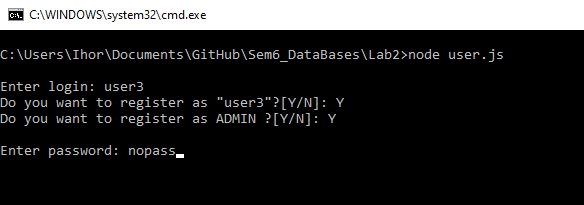
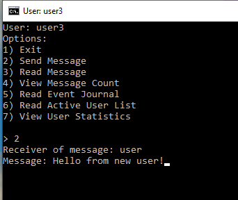
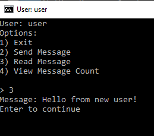

# Лабораторна робота №2

|  Структура | Пояснення використання                                                                                                                                                                                                                                                                                                                                                                                                                                                                                                                                                                                                                                                                                                                                                                                                                                                          |
|:----------:|---------------------------------------------------------------------------------------------------------------------------------------------------------------------------------------------------------------------------------------------------------------------------------------------------------------------------------------------------------------------------------------------------------------------------------------------------------------------------------------------------------------------------------------------------------------------------------------------------------------------------------------------------------------------------------------------------------------------------------------------------------------------------------------------------------------------------------------------------------------------------------|
|    List    | В даному випадку використвується звичайний список бо потрібні ефективні операції додавання елементів на отримання елементів на конкретній позиції.     "Список отриманих повідомленнь користувача": Сюди додаються ідентифікатори повідомленнь після перевірки їх вмісту на спам сервером.     "Список надісланих повідомленнь користувача": Сюди додаються ідентифікатори повідомленнь після їх надсилання на сервер відповідним користувачем.     "Журнал подій": Сюди додаються записи в форматі JSON про входи/виходи користувачів та випадки виявлення спаму.                                                                                                                                                                                                                                                                                            |
|    Hash    | В даному випадку використовується хеш-таблиця бо потрібне ефективне отримання/оновлення даних.     "Дані повідомлення": При створенні повідомлення користувачем створюється запис про повідомлення з інформацією про надсилача, отримувача, вміста та статуса доставки повідомлення.    "Дані користувача": При реєстрації користувача створюється запис з інформацією про наявність паролю та наявність прав доступу адміністратора.                                                                                                                                                                                                                                                                                                                                                                                                                               |
| Sorted Set | В даному випадку використовується сортована множина бо потрібні методи ефективного додавання елементів з приорітетом/збільшення приорітету/отримання деякої кількості елементів з найбільшим приорітетом.    "Список активних користувачів": Сюди записуються логіни/збільшуються приорітети користувачів при надсиланні повідомленнь. Користувачі з правами адміністратора мають право переглянути список N користувачів з найбільшими приорітетами.    "Список активних спамерів": Сюди записуються логіни/збільшуються приорітети користувачів при вияву спаму в повідомленнях. Користувачі з правами адміністратора мають право переглянути список N користувачів з найбільшими приорітетами.                                                                                                                                                                   |
|     Set    | В даному випадку використовується множина бо вона має  більш оптимальні методи додавання/видаляння записів в порівнянні з іншими структурами даних.    "Користувачі онлайн": Коли користувач успішно заходить/виходить з системи в дану множину додається/видаляється його логін.                                                                                                                                                                                                                                                                                                                                                                                                                                                                                                                                                                                         |
|   Pub/Sub  | Даний інструмент використовується для передачі інформації між користувачами/серверами/робочими бо він надає можливість компонентам системи ефективно відповідати на отриману інформацію.    "Канал дій": Користувачі публікують сюди обєкти подій в форматі JSON  коли користувач входить/виходить/надсилає повідомлення.   Сервер підписується сюди і обробляє дані подій додаючи  події входу/виходу в журнал подій.    "Канал необроблених повідомленнь": Сервер публікує сюди ідентифікатори повідомленнь.   Робочі підписуєтюся сюди і перевіряють повідомлення з даними ідентифікаторами на спам.    "Канал оброблених повідомленнь": Робочі публікують сюди інформації про наявність спаму в повідомленні в форматі JSON.   Сервер підписується сюди і додає отримані повідомлення до списку отриманих повідомленнь відповідного користувача. |

### Реєстрація користувача

### Надсилання повідомлення

### Читання повідомлення

