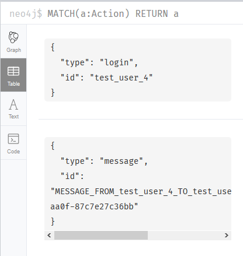
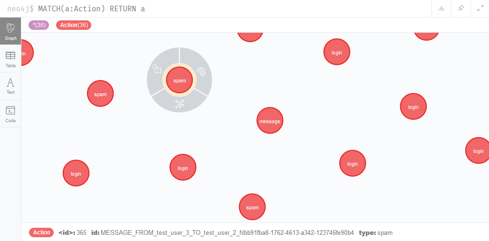
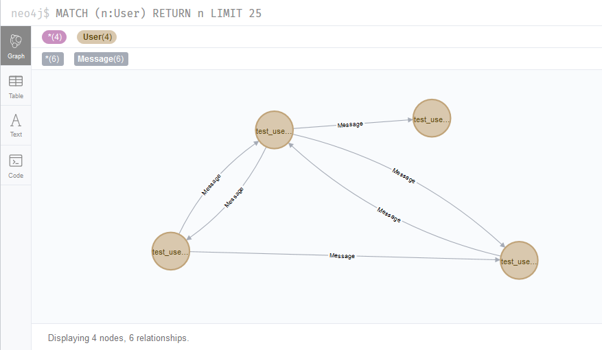
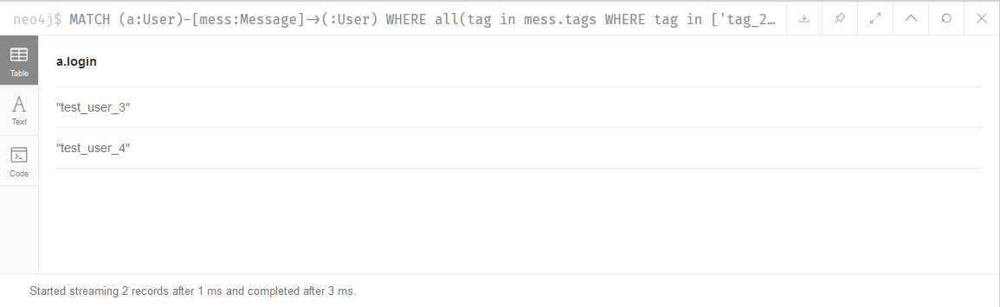
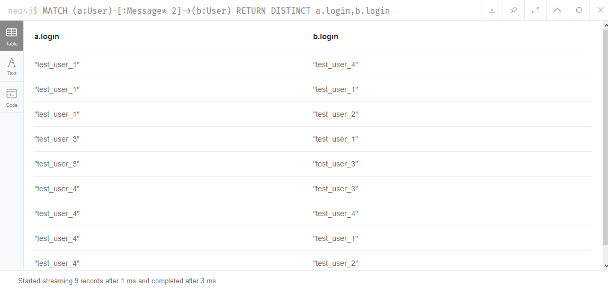
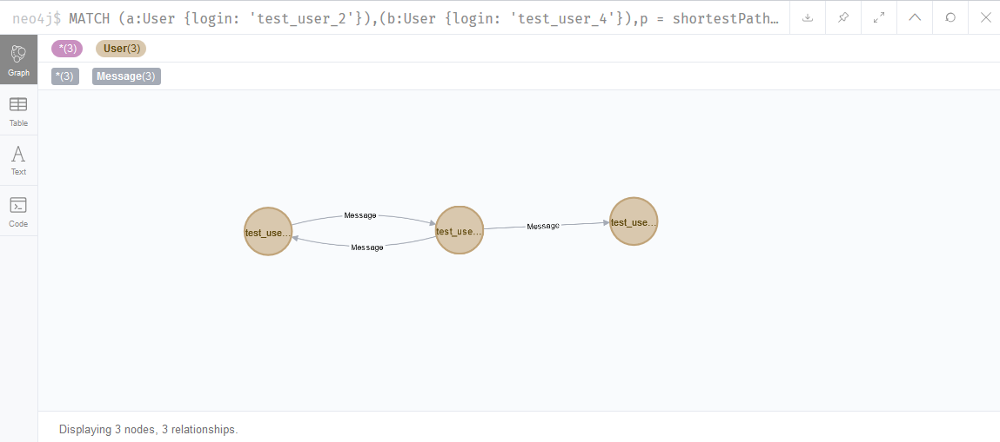
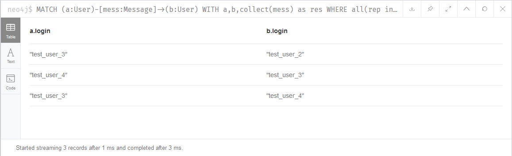

# Лабораторна робота №3

### Запит 1
#### Задано список тегів ( tags ). Знайти всіх користувачів, що відправили або отримали повідомлення з набором тегів tags.

##### MATCH (a:User)-[mess:Message]->(:User) WHERE all(tag in mess.tags WHERE tag in ['tag_2','tag_3','tag_4']) RETURN DISTINCT a.login

### Запит 2
#### Задано довжину зв’язку N - кількість спільних повідомлень між користувачами. Знайти усі пари користувачів, що мають зв’язок довжиною N через відправлені або отримані повідомлення. Наприклад, якщо користувач A відправив повідомлення користувачу B, а B відправив повідомлення С, то довжина зв’язку між А і С є N=2.

#### MATCH (a:User)-[:Message* 2]->(b:User) RETURN DISTINCT a.login,b.login

### Запит 3
#### Задано два користувача. Знайти на графі найкоротший шлях між ними через відправлені або отримані повідомлення.

#### MATCH (a:User {login: 'test_user_4'}),(b:User {login: 'test_user_2'}),p = shortestPath((a)-[:Message* ]-(b)) RETURN p

### Запит 4
#### Знайти авторів повідомлень, які пов’язані між собою лише повідомленнями, позначеними як “спам”.

#### MATCH (a:User)-[mess:Message]->(b:User) WITH a,b,collect(mess) as res WHERE all(rep in res WHERE rep.spam = true) RETURN a.login,b.login

### Запит 5
#### Задано список тегів (t ags ). Знайти всіх користувачів, що відправили або отримали повідомлення з набором тегів tags, але ці користувачі не пов’язані між собою.

